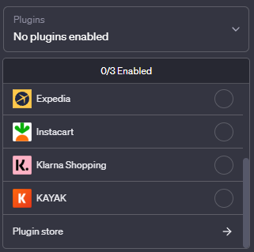

# Plugin-TODO-GPT 📝

## Description

This project deals with the use of plugins in conjunction with ChatGPT, in this case it is a plugin and an API, which allow you to manage your pending tasks, either adding new tasks or deleting them. This project is divided into three directories:

- `.well-known`: Mandatory folder for ChatGPT to connect to the plugin, containing:
  - `ai-plugin.json`: Manifest file with useful data for the model.
  - `openapi.json`: API definition. [Learn more](https://swagger.io/specification/)
- `ProxyHTTP.py`: Handles the connection between ChatGPT and the API.
- `API`: Contains the API itself:
  - `API.py`: Receives ChatGPT requests and responds with the necessary information.
  - `todos.json`: File containing the TODOs information.

## Run the project 🚀

1. **Python version**: 3.9
2. **Create virtual environment**: `python -m venv Plugin`
3. **Install dependencies**: `pip install -r requirements.txt`
4. **Run the API**:
cd .\API
python API.py
cd ..
5. **Run the local proxy**:
cd .well-known
python ProxyHTTP.py

## Upload the plugin to ChatGPT 🌐

1. Go to PluginStore:

2. Select **Develop your own plugin**:

3. Enter the local host and port (e.g., `localhost:420`):

4. Click **Install localhost plugin**:

Now you can use your plugin in ChatGPT! 🎉
